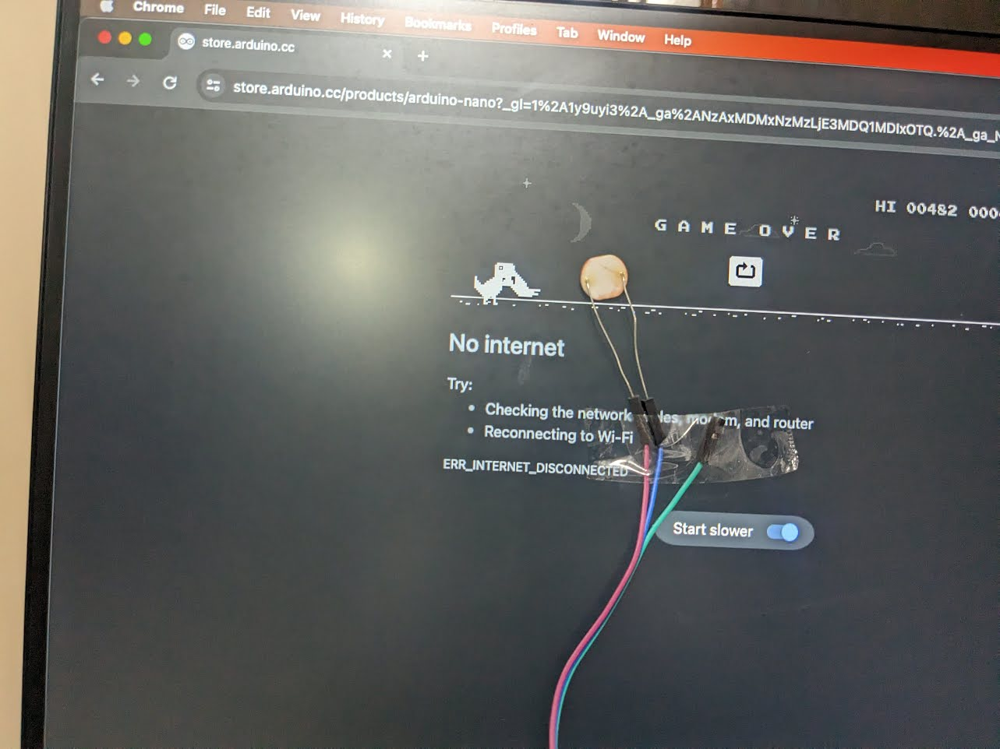
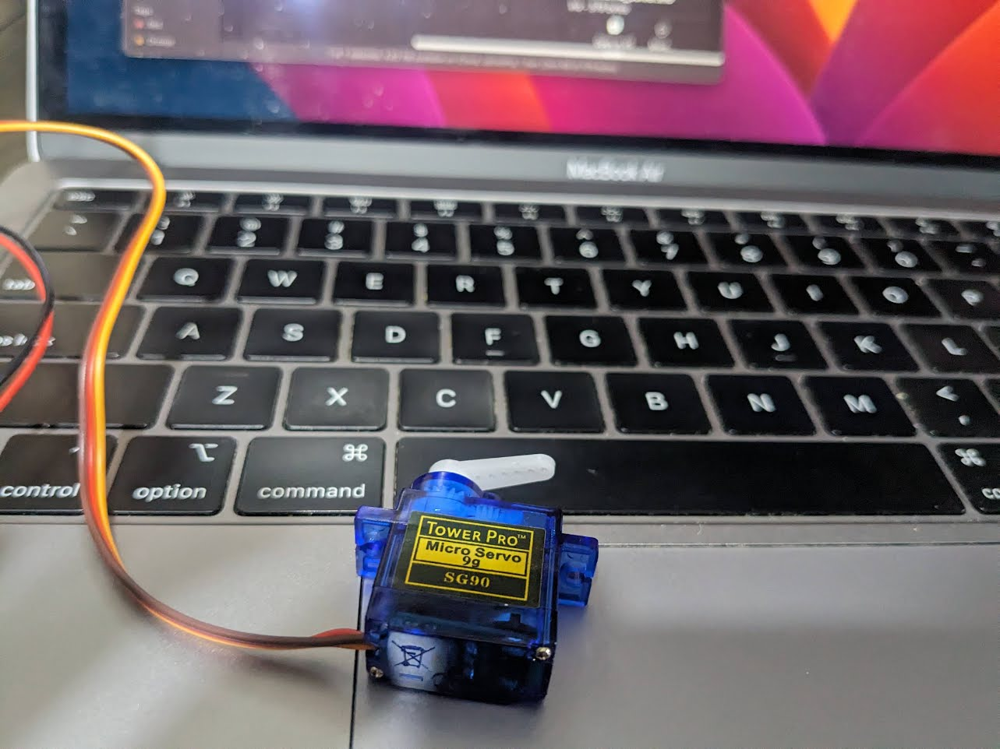
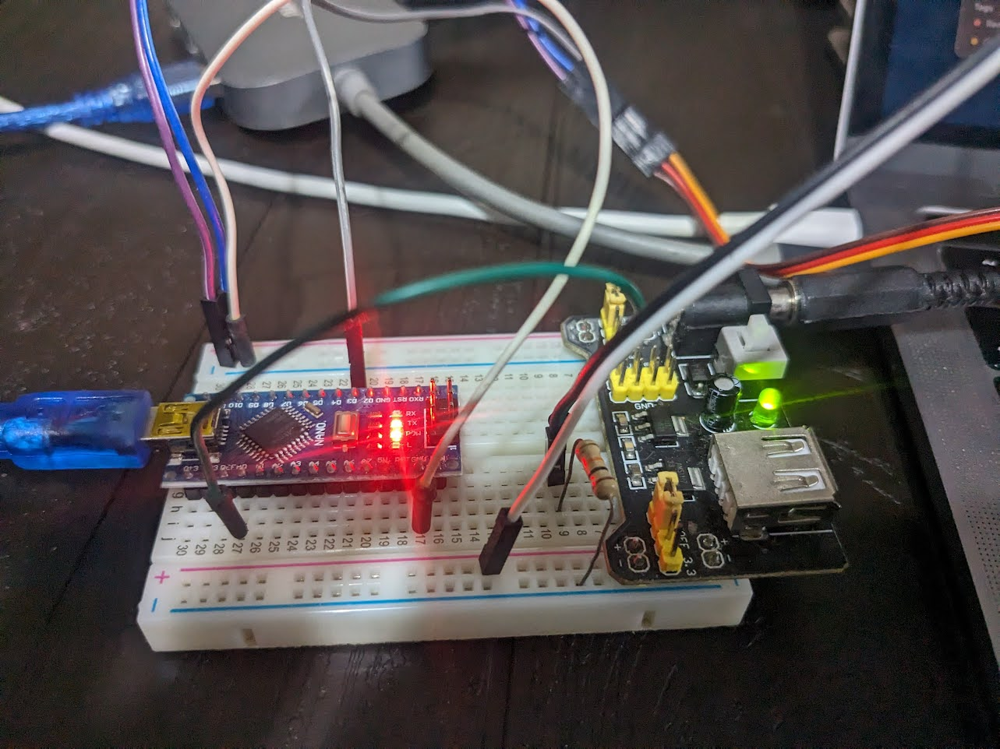
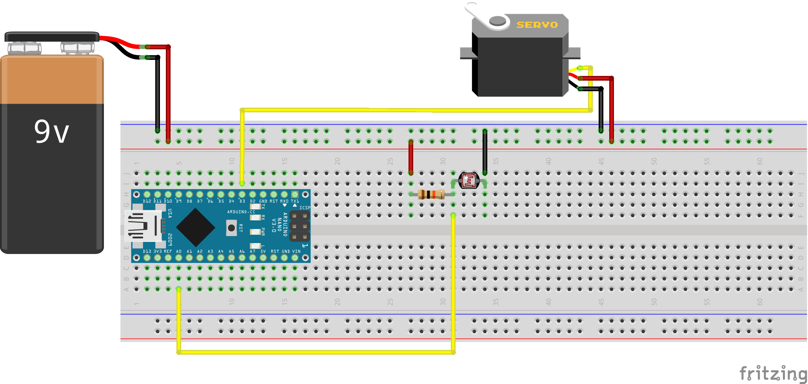

# DinoChrome Solver

When an object approaches the dinosaur, a photoresistor checks for its presence

Once the photoresistor detects an object, it activates a servo motor to press the space bar, causing the dinosaur to jump

The entire system is controlled by an Arduino Nano and powered by an external power supply

The electronic schematic is

You can see it working at

## Follow me

- [Youtube](https://www.youtube.com/channel/UC5MAQWU2s2VESTXaUo-ysgg)
- [Github](https://www.github.com/danny270793/)
- [LinkedIn](https://www.linkedin.com/in/danny270793)

## LICENSE

Licensed under the [MIT](license.md) License

## Version

DinoChrome Solver version 1.0.0

Last update 09/01/2024
